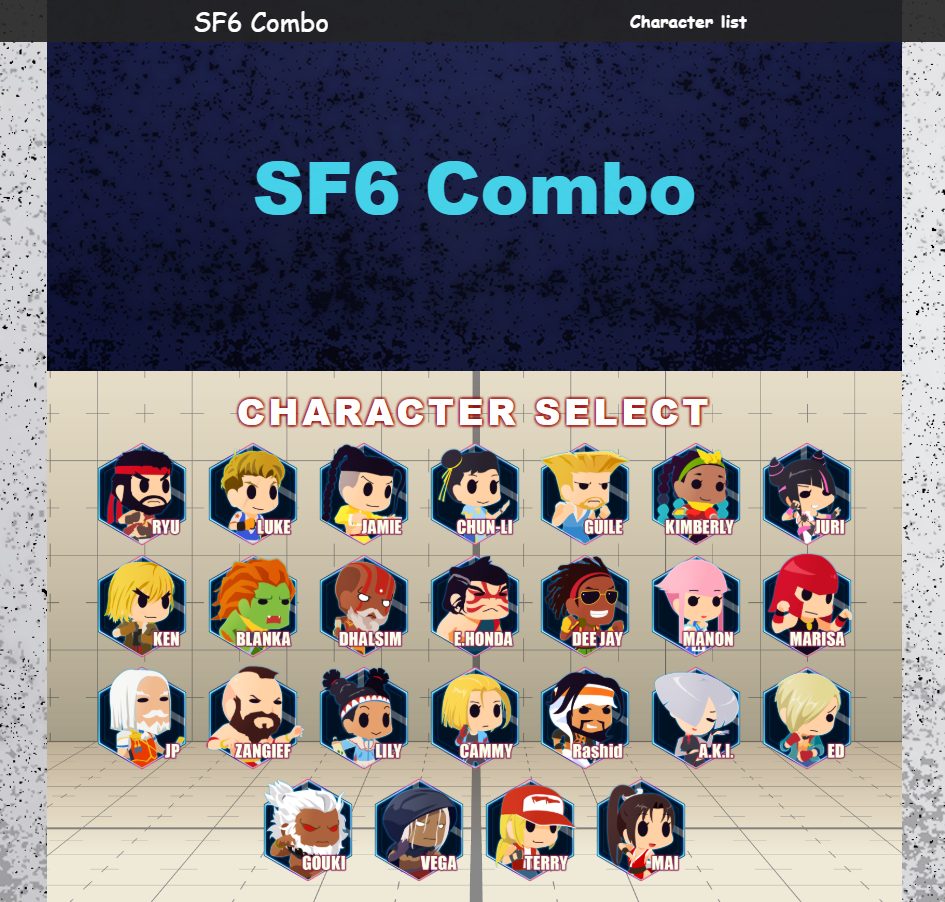

# SF6 Combo Site (SF6 コンボまとめサイト)

これは、ストリートファイター6のコンボを記録、検索、共有するためのWebアプリケーションです。

## 概要

このサイトは、ストリートファイター6のプレイヤーがキャラクターごとのコンボを簡単に検索したり、新しいコンボを発見したり、自身のコンボを共有したりすることを目的としています。

## トップページ



## 主な機能

* キャラクターごとのコンボ表示

* コンボ検索機能

* コンボフィルター機能 (難易度、操作タイプ、起き攻め、ヒット状況などでフィルター)

* コンボ詳細情報 (コンボレシピ、ダメージ、使用ゲージ、ヒット後の状況、など)

* 管理者による投稿機能 (おしらせ、コンボ)

* レスポンシブデザイン (PC、スマートフォン対応)

## 技術スタック

* **バックエンド:** Python, Django
* **フロントエンド:** HTML, CSS
* **データベース:** SQLite3 (開発用), PostgreSQL (本番環境)
* **デプロイ:**  Render 

## ローカル環境でのセットアップ

このプロジェクトをローカル環境で動かすための手順は以下の通りです。

1.  **リポジトリをクローンします:**
    ```bash
    git clone [https://github.com/AlLe-N/sf6_combo.git](https://github.com/AlLe-N/sf6_combo.git)
    cd sf6_combo
    ```

2.  **仮想環境を作成し、有効化します:** 
    ```bash
    python -m venv venv
    ```
    * Windowsの場合:
        ```bash
        venv\Scripts\activate
        ```
    * macOS/Linuxの場合:
        ```bash
        source venv/bin/activate
        ```

3.  **必要なライブラリをインストールします:**
    ```bash
    pip install -r requirements.txt
    ```

4.  **環境変数の設定:** 
    プロジェクトルートに `.env` ファイルを作成し、必要な環境変数を設定してください。
    ```
    # .env ファイルの例
    SECRET_KEY='your_secret_key'
    DEBUG=True
    ```

5.  **データベースのマイグレーションを実行します:**
    ```bash
    python manage.py migrate
    ```

6.  **(任意) スーパーユーザーを作成します:** (管理画面にアクセスする場合)
    ```bash
    python manage.py createsuperuser
    ```
    指示に従ってユーザー名、メールアドレス、パスワードを設定してください。

7.  **開発サーバーを起動します:**
    ```bash
    python manage.py runserver
    ```
    ブラウザで `http://127.0.0.1:8000/` にアクセスすると、サイトが表示されます。

## サイトへのアクセスと現在の状況

サイトURL: [SF6 Combo Site](https://django-render-7kxt.onrender.com/) 
(無料版を使用しているため、最初の起動には時間がかかります。)   <br />
(無料のデータベースを使用しており、一定期間ごとに作成しなおす必要があるため、現在は投稿をしていない状態です。)


## 今後の開発予定 (TODO)

* [ ] ユーザーによるコンボ評価機能

* [ ] ユーザーによるアカウント登録

* [ ] ユーザーによるコンボ投稿機能

* [ ] フロントをReactに変更

---